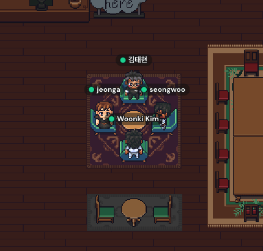

# 🍃 InflearnStudy
> 인프런 [김영한님의 백엔드 로드맵](https://www.inflearn.com/roadmaps?title=%EA%B9%80%EC%98%81%ED%95%9C&page=1) 을 따라 강의를 듣고 스터디한것을 기록하는 레포지토리입니다.  

 

## 📚 강의목록
- [스프링 핵심 원리 - 기본편](https://www.inflearn.com/course/%EC%8A%A4%ED%94%84%EB%A7%81-%ED%95%B5%EC%8B%AC-%EC%9B%90%EB%A6%AC-%EA%B8%B0%EB%B3%B8%ED%8E%B8)
- [스프링 MVC 1편 - 백엔드 웹 개발 핵심 기술](https://www.inflearn.com/course/%EC%8A%A4%ED%94%84%EB%A7%81-mvc-1)
- [스프링 MVC 2편 - 백엔드 웹 개발 활용 기술](https://www.inflearn.com/course/%EC%8A%A4%ED%94%84%EB%A7%81-mvc-2/)
- [자바 ORM 표준 JPA 프로그래밍 - 기본편](https://www.inflearn.com/course/ORM-JPA-Basic)
- [실전! 스프링 부트와 JPA 활용1 - 웹 애플리케이션 개발](https://www.inflearn.com/course/%EC%8A%A4%ED%94%84%EB%A7%81%EB%B6%80%ED%8A%B8-JPA-%ED%99%9C%EC%9A%A9-1)
- [실전! 스프링 부트와 JPA 활용2 - API 개발과 성능 최적화](https://www.inflearn.com/course/%EC%8A%A4%ED%94%84%EB%A7%81%EB%B6%80%ED%8A%B8-JPA-API%EA%B0%9C%EB%B0%9C-%EC%84%B1%EB%8A%A5%EC%B5%9C%EC%A0%81%ED%99%94)

 

## 목표
- 2022년도 취업에 사용할 포트폴리오 제작을 위해서 프로젝트 경험을 쌓는것이 목표입니다.
- `1단계` : 강의를 듣고 스프링 기초 지식 충분히 쌓기 (약 2 ~ 3주)
  - ~~강의당 1주 완강 목표~~
- `2단계` : 본격적인 프로젝트 제작

 

## 👋 구성원
- [김운기](https://github.com/woonki94)
- [김성우](https://github.com/tjddnghkrk)
- [김태현](https://github.com/ffolabear)
- [박정아](https://github.com/jeonga1048)

 

### 👉 강의별 정리노트 페이지 바로가기
- [스프링 핵심 원리 - 기본편](https://github.com/ffolabear/InflearnStudy/blob/main/SpringBasic/README_basic.md)
- [스프링 MVC 1편 - 백엔드 웹 개발 핵심 기술](https://github.com/ffolabear/InflearnStudy/blob/main/SpringMVC1/README_MVC1.md)
- [스프링 MVC 2편 - 백엔드 웹 개발 활용 기술](https://github.com/ffolabear/InflearnStudy/blob/main/SpringMVC2/README_MVC2.md)
- 실전! 스프링 부트와 JPA 활용1 - 웹 애플리케이션 개발

 

### 👉 강의별 연습문제 페이지 
- 스프링 핵심 원리 연습문제  
  - [회원 ~ 주문생성까지 구현 가이드라인](https://github.com/ffolabear/InflearnStudy/blob/main/SpringPractice/SpringPractice1.md)

 

## 🗒 진행방식

- 스터디는 주 2회 진행
- 스프링 강의를 듣고 공부하는 동안에는 하루는 `온라인`, 하루는 `오프라인` 으로 진행
  -  `온라인 스터디` 는 서로 중간점검을 목적으로하고 `오프라인` 스터디에서는 자유롭게 진행(미정)
- 추후 프로젝트 제작기간 동안진행방식은 미정

 

## ✅ Commit Rule
- 강의별로 생성된 패키지 안에 공부하고 정리하고 싶은 내용을 자유롭게 작성
- 파일이름은 `강의이름_닉네임` 으로 작성
- 첫번째 문자는 대문자로 작성하며 단어와 단어의 구분은 camel case로 하되 깃허브 아이디는 snake case (언더바 _ )로 구분
  - ex) `SpringMVC_ffbear.md`, `JPA1_tjddnghkrk.md`

 

## ✏️ 스터디 진행 현황
🟩  : 온라인 스터디  
🟧  : 오프라인 스터디  

 

- 2022.02.15 : 🟧 OT
  - **숙제 : 스프링 MVC 1편 Section2 까지 공부하기**

 

- 2022.02.18 : 🟩 스터디 중간점검
  - **숙제 : 스프링 MVC 1편 Section6 까지 공부하기**

 

- 2022.02.21 : 🟩 스터디 중간점검
  - 변동없음

 

- 2022.02.24 : 🟧 스터디 중간점검
  - **숙제 : 3월 3일 까지 스프링 핵심원리 완강**

 

- 2022.02.28 : 🟩 스터디 중간점검
  - **숙제 : 3월 3일 까지 스프링 핵심원리 완강**
  - 스터디원 추가로 인한 진도 재설정

 

- 2022.03.04 : 🟧 스터디 중간점검
  - 회원가입 ~ 주문하기 까지 가이드라인 보고 구현해보기
  - [가이드라인](https://github.com/ffolabear/InflearnStudy/blob/main/SpringPractice/SpringPractice1.md)

 

- 2022.03.07 : 🟩 스터디 중간점검 - [Gather](https://gather.town/) 로 진행
  - **숙제 : 3월 10일 까지 스프링 MVC 1편 최소 Section2 까지**
  - 3월 10일 부터 스프링부트를 사용한 게시판 구현하기로 결정
    - 직접 구현해보면서 강의 들으면 더 좋은효과를 볼것 같다는 의견에 모두 동의
  - 

    
스터디 사진

       

            

                
           
      
       

    

 

- 2022.03.10 : 🟧 스터디 중간점검 
  - **숙제 : 3월 14일 까지 스프링 MVC 1편 Section 4 까지 듣기**
    - 프로젝트 - 주제 2개씩 생각
    - CS 질문 - 답변 하나씩 준비

 

- 2022.03.17 : 🟩 스터디 중간점검 
    - CS 질문 - 답변 하나씩 준비

 

- 2022.03.21 : 🟧  스터디 중간점검 
  - **숙제 : 3월 24일 까지 게시판 구현**
    - CS 질문 - 답변 하나씩 준비

 

- 2022.03.25 : 🟧  스터디 중간점검 
  - 게시판 만들기는 각자 해보기
    - 참고 링크 : https://www.youtube.com/playlist?list=PLZzruF3-_clsWF2aULPsUPomgolJ-idGJ
  - MVC 1편 듣고 MVC 2편으로 넘어가는 것이 아닌 바로 JPA로 넘어가기로 결정 (자바 ORM 표준 JPA 프로그래밍 - 기본편)

 

- 2022.03.28 : 🟧  스터디 중간점검 

 
 
