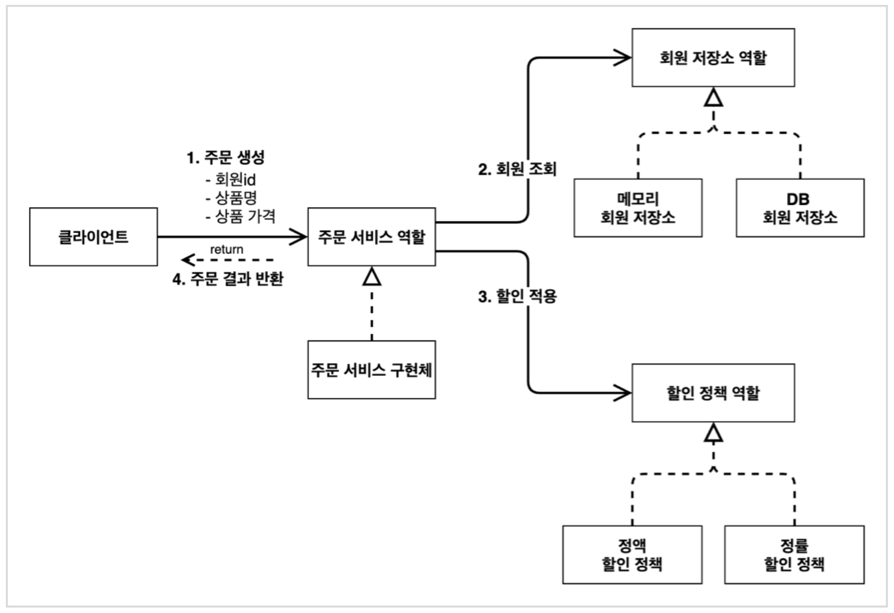
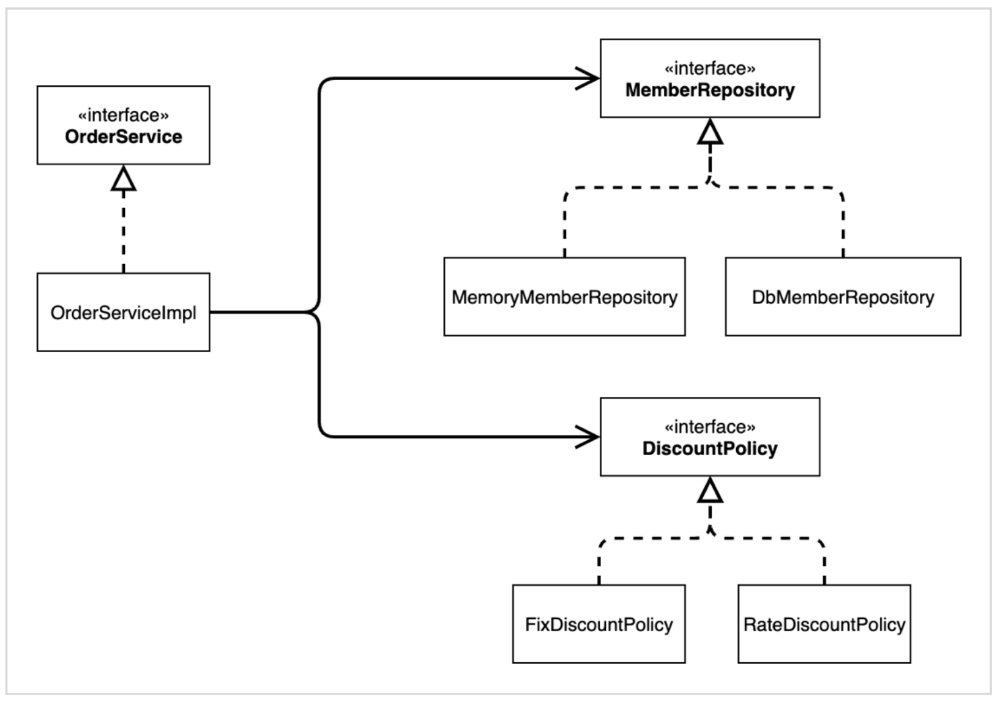

# 스프링 핵심 원리 - 연습문제
_스프링 핵심 원리 - 기본편 을 듣고 진행하는 연습문제입니다._

> 목표 : 주문 - 회원 -  할인로직 까지 구현하기

 

    

 

### 기본 설정

- [스프링 부트 스타터 사이트](https://start.spring.io/)로 이동해서 스프링 프로젝트 생성  
    - 프로젝트 선택
        - Project: Gradle Project 
        - Spring Boot: 2.3.x 
        - Language: Java 
        - Packaging: Jar
        - Java: 11
            
    - Project Metadata
        - groupId: hello 
        -  artifactId: core
    -  Dependencies: 선택하지 않는다.

 

 
    
## 회원 로직

    

- #### 회원 엔티티
    
    - ##### `Member`
        - `Long` ID
        - `String` name
        - `Enum` `Grade` - BASIC, VIP
        - `Getter`, `Setter`
    
 

- #### 회원 저장소
    - ##### `MemberRepository` (인터페이스)
        - `save(Member member)`
        - `findById(Long memberId)`

    - ##### `MemoryMemberRepository` - 인터페이스 구현체  (스프링컨테이너 관리 대상)
        -  회원정보 담은 Map
        - `save(Member member)`
        - `findById(Long memberId)`

 

- #### 회원 서비스
    - ##### `MemberService` (인터페이스)
        - `join(Member member)`
        - `findMember(Long memberId)`
            - `Member` 객체 리턴
    
    - ##### `MemberServiceImpl` - 인터페이스 구현체  (스프링컨테이너 관리 대상)
        - DI (생성자주입)
        - `join()`, `findMember()` 둘다 의존관계 주입된 객체 사용
    
    

 

- #### 회원 가입 Main `MemberApp`
    - 스프링 컨테이너에 저장된 빈 사용
        - 특정 빈을 가져와야 그 메서드를 사용할 수 있다. 
    - 회원 가입 ( `join` )
    - 특정 회원 조회( `findMember` )
    - 회원 가입 테스트코드 작성

 

 

## 주문 로직

 

    

- #### 할인 정책 
    - ##### `DiscountPolicy` (인터페이스)
        - `discount(Member member, int price)`      

    - ##### `FixDiscountPolicy` (인터페이스 구현체) - 정액 할인 정책(고정 금액)
    - ##### `RateDiscountPolicy` (인터페이스 구현체) - 정률 할인 정책(주문 금액에 따라 % 할인)
        - `discount(Member member, int price)`
        - 회원의 등급에(VIP, BASIC) 따라 할인금액을 책정 

 

- #### 주문 엔티티
    - ##### `Order`
        - `Long` memberId
        - `String` itemName
        - `int` itemPrice
        - `int` discountPrice
        - `Getter`, `Setter`, 
        - `calculatePrice`

 

- #### 주문 서비스
    - ##### `OrderService` (인터페이스)
        - `createOrder`
            - `Order` 객체 리턴

    - ##### `OrderServiceImpl` 인터페이스 구현체  (스프링컨테이너 관리 대상)
        - DI 생성자 주입
        - `createOrder` 는 의존관계 주입된 객체 사용 

 

- #### 주문 Main `OrderApp`
    - 스프링컨테이너에서 가져온 빈에 새로운 회원을 저장
    - 등록한 회원의 정보로 새오운 주문 생성

 

     

## 스프링 설정정보 클래스

- `AutoAppConfig` 
    - 역할과 구현을 분리하고 DIP 와 OCP 를 지키기 위한 클래스

 
 
